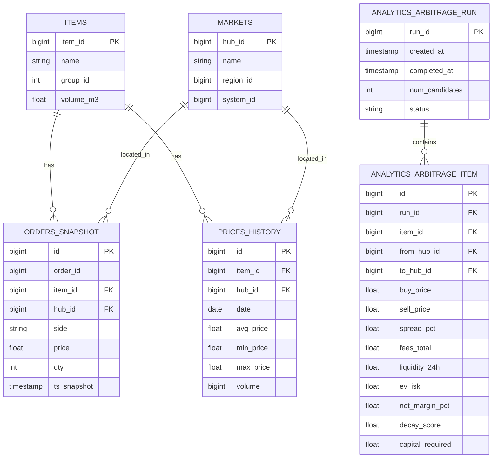

# EVE Market Intelligence

Production-ready Python system for discovering cross-hub arbitrage opportunities in EVE Online markets.

[](https://github.com/yourorg/eve-intel/actions)
[](https://www.python.org/downloads/)
[](https://github.com/psf/black)

## Features

- 🔍 **Cross-hub arbitrage detection** with full P&L accounting (fees, taxes, slippage)
- 📊 **Expected value (EV) ranking** factoring in liquidity and decay risk
- 🚀 **FastAPI endpoints** for real-time signals (read-only in Phase 1)
- 🛠️ **Typer CLI** for maintenance and analysis commands
- ⏰ **Automated ingestion** via APScheduler (4-hour cycles)
- 📈 **Grafana dashboards** for monitoring candidates and trends
- 🐳 **Docker-first** with PostgreSQL, ClickHouse, Redis, and Grafana
- ✅ **TDD with 70%+ coverage** (PyTest + async support)
- 🔒 **Config via .env** with pydantic-settings (never commit secrets)

## Architecture

```
┌──────────────┐      ┌──────────────┐      ┌──────────────┐
│  ESI API     │─────▶│  Worker      │─────▶│  Postgres    │
│  (public)    │      │  (scheduler) │      │  (fact data) │
└──────────────┘      └──────────────┘      └──────────────┘
                             │                      │
                             ▼                      ▼
                      ┌──────────────┐      ┌──────────────┐
                      │ Analytics    │─────▶│  FastAPI     │
                      │ Engine       │      │  (read-only) │
                      └──────────────┘      └──────────────┘
                             │                      │
                             ▼                      ▼
                      ┌──────────────┐      ┌──────────────┐
                      │  ClickHouse  │      │  Grafana     │
                      │  (analytics) │      │  (viz)       │
                      └──────────────┘      └──────────────┘
```

## Data Model (ERD)



## Quickstart

### Prerequisites

- Docker & Docker Compose
- Python 3.13+ (for local dev)
- Poetry (for dependency management)

### 1. Clone & Setup

```bash
git clone https://github.com/yourorg/eve-intel.git
cd eve-intel

# Copy environment template
cp .env.example .env

# Edit .env with your settings (optional for dev)
```

### 2. Start Services

```bash
# Start all containers (postgres, redis, clickhouse, api, worker, grafana)
make up

# View logs
make logs

# Check health
curl http://localhost:8000/health
```

**Services running:**
- API: http://localhost:8000
- Grafana: http://localhost:3000 (admin/admin)
- PostgreSQL: localhost:5432
- Redis: localhost:6379
- ClickHouse: localhost:8123

### 3. Seed Database

```bash
# Seed items and markets (run once)
docker-compose exec api python scripts/seed.py
```

### 4. Use the API

```bash
# Get arbitrage signals (mock data in Phase 1)
curl "http://localhost:8000/signals/arbitrage?min_ev=200000000&limit=10" | jq

# Run fresh analysis
curl -X POST "http://localhost:8000/signals/arbitrage/analyze" | jq
```

### 5. Use the CLI

```bash
# Local development
poetry install
poetry run python -m eve_intel.cli find-arb --min-ev 200000000

# Or via Docker
docker-compose exec api python -m eve_intel.cli find-arb --min-ev 200000000
```

### 6. View Grafana Dashboard

1. Open http://localhost:3000
2. Login: `admin` / `admin`
3. Navigate to **EVE Market Arbitrage** dashboard

## Development

### Install Dependencies

```bash
poetry install
```

### Run Locally

```bash
# Run API in dev mode
make dev

# Run worker
poetry run python -m eve_intel.worker

# Run migrations
make migrate
```

### Testing

```bash
# Run all tests with coverage
make test

# Run specific test file
poetry run pytest tests/unit/test_fees.py -v

# Run with coverage report
poetry run pytest --cov-report=html
```

### Code Quality

```bash
# Format code
make fmt

# Lint
make lint

# Pre-commit hooks
make pre-commit
make pre-commit-run
```

## Configuration

All configuration via `.env` (see `.env.example`). Key settings:

| Variable | Description | Default |
|----------|-------------|---------|
| `DATABASE_URL` | Async Postgres connection | `postgresql+asyncpg://...` |
| `REDIS_URL` | Redis cache URL | `redis://redis:6379/0` |
| `BROKER_FEE_PCT` | Broker fee % | `3.0` |
| `SALES_TAX_PCT` | Sales tax % | `8.0` |
| `MIN_EV_ISK` | Min expected value filter | `200000000` |
| `MIN_NET_MARGIN_PCT` | Min net margin filter | `5.0` |
| `MIN_LIQUIDITY_ISK_24H` | Min 24h liquidity | `500000000` |
| `MARKET_HUBS` | Comma-separated hub IDs | `60003760,60008494,...` |
| `INGESTION_CRON_SCHEDULE` | Market data cron | `0 */4 * * *` |
| `ANALYTICS_CRON_SCHEDULE` | Analytics cron | `15 */4 * * *` |

## Project Structure

```
eve-intel/
├── eve_intel/
│   ├── __init__.py
│   ├── settings.py          # Pydantic settings
│   ├── logging.py           # Structlog config
│   ├── cli.py               # Typer CLI
│   ├── worker.py            # APScheduler worker
│   ├── db/
│   │   ├── models.py        # SQLAlchemy models
│   │   ├── base.py          # Session management
│   │   └── repositories.py  # Data access layer
│   ├── datasources/
│   │   ├── esi.py           # ESI client (retry, cache)
│   │   ├── cache.py         # Cache adapters
│   │   └── adapters/
│   │       └── mock.py      # Mock ESI for tests
│   ├── analytics/
│   │   ├── fees.py          # Fee calculations
│   │   ├── risk.py          # Risk scoring
│   │   └── arbitrage.py     # Arbitrage engine
│   └── api/
│       ├── main.py          # FastAPI app
│       └── routers/
│           └── arbitrage.py # Arbitrage endpoints
├── alembic/
│   ├── versions/            # Database migrations
│   └── env.py
├── scripts/
│   └── seed.py              # Seed data script
├── tests/
│   ├── unit/                # Unit tests
│   └── conftest.py          # Pytest fixtures
├── grafana/
│   ├── provisioning/        # Datasources & dashboards
│   └── dashboards/
├── artifacts/               # Output files
├── docker-compose.yml
├── Dockerfile.api
├── Dockerfile.worker
├── Makefile
├── pyproject.toml
└── README.md
```

## Phase 1 (MVP) - ✅ COMPLETE

- [x] Ingestion layer (ESI client with backoff + caching)
- [x] Database schema (Postgres + Alembic migrations)
- [x] Core analytics (arbitrage with fees, liquidity, EV)
- [x] FastAPI endpoints (`/signals/arbitrage`)
- [x] Typer CLI (`find-arb` command)
- [x] Docker compose stack (app + postgres + clickhouse + redis + grafana)
- [x] Scheduler (APScheduler for periodic jobs)
- [x] Unit tests (70%+ coverage)
- [x] Grafana dashboard (candidates count, EV trends)
- [x] Documentation (README, ERD, quickstart)

## Phase 2 Roadmap (Future)

- [ ] **Full ESI integration**: real-time market orders ingestion
- [ ] **ClickHouse analytics**: OLAP for time-series queries
- [ ] **Route risk scoring**: integrate zKillboard API for danger ratings
- [ ] **Alert system**: Discord/Slack webhooks for high-EV signals
- [ ] **Portfolio tracking**: multi-character wallet sync
- [ ] **ML forecasting**: price trend prediction with sklearn/lightgbm
- [ ] **Write endpoints**: order placement via ESI (requires auth)
- [ ] **Advanced filters**: volume constraints, cargo capacity, route planning

## API Documentation

Once running, visit http://localhost:8000/docs for interactive Swagger UI.

### Key Endpoints

**GET /signals/arbitrage**
- Returns ranked arbitrage opportunities
- Query params: `min_ev`, `min_margin`, `limit`

**POST /signals/arbitrage/analyze**
- Runs fresh analysis
- Query params: `min_ev`, `min_margin`, `save_results`

**GET /health**
- Health check

## CLI Commands

```bash
# Find arbitrage opportunities
python -m eve_intel.cli find-arb --min-ev 200000000 --min-margin 5.0 --limit 50

# Save to custom file
python -m eve_intel.cli find-arb --output-file my_arb.json

# Save to database
python -m eve_intel.cli find-arb --save-db

# Run migrations
python -m eve_intel.cli db-migrate

# Downgrade migrations
python -m eve_intel.cli db-downgrade
```

## Troubleshooting

### Database connection errors

```bash
# Check postgres is running
docker-compose ps postgres

# Check connection from container
docker-compose exec api psql $DATABASE_URL_SYNC -c "SELECT 1"
```

### Redis connection errors

```bash
# Check redis is running
docker-compose exec redis redis-cli ping
```

### Tests failing

```bash
# Ensure test database is clean
poetry run pytest --verbose

# Run with debugging
poetry run pytest -vv -s
```

## Contributing

1. Fork the repo
2. Create feature branch (`git checkout -b feature/amazing`)
3. Make changes with tests
4. Run `make lint` and `make test`
5. Commit (`git commit -m 'Add amazing feature'`)
6. Push (`git push origin feature/amazing`)
7. Open Pull Request

## License

MIT License - see LICENSE file for details.

## Acknowledgments

- EVE Online & CCP Games for the ESI API
- EVE community for market data insights

## Contact

- Issues: https://github.com/yourorg/eve-intel/issues
- Discussions: https://github.com/yourorg/eve-intel/discussions

---

**Fly safe, trade smart.** o7
